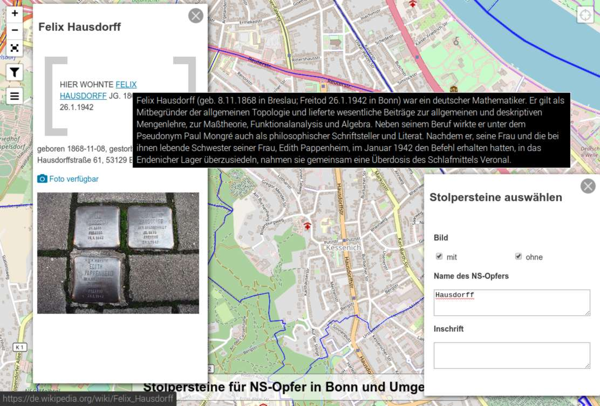

# stolperstein-bonn

In Bonn sind bislang (Stand 12/2014) 275 Stolpersteine verlegt worden,
die an Opfer der NS-Gräuel erinnern sollen. Die Absicht dieses Projekts
besteht darin, die Bonner Stolpersteine in einem möglichst offenen
Format digital aufzubereiten. Auf diese Weise sollen die Schicksale, für
die diese Stolpersteine stehen, auch in der der virtuellen Datenwelt
präsent werden.

Die Darstellung hat zwei Arten von Markern, graue und blaue. Die blauen
markieren Stolpersteine, deren Fotos online sind, die grauen solche, bei
denen nur Textinformationen zur Verfügung stehen (aktuell sollten graue
nur außerhalb von Bonn, Königswinter und Bad Honnef erscheinen, da es
dort von allen aktuell verlegten Stolpersteinen ein Foto gibt).

## Demo

Die Demo findet sich unter
http://stolpersteine-in-bonn.de/

## Datenquellen

### Stolpersteine

Die Informationen zu den Stolpersteinen werden live aus der
OpenStreetMap-Datenbank heruntergeladen.

### Grenzen der Stadt, Stadtbezirke und Ortsteile

Die verwendeten Informationen sind von der Stadt Bonn als OpenData der
Allgemeinheit zur Verfügung gestellt worden.

* Lizenz: https://creativecommons.org/publicdomain/zero/1.0/

* Ortsteile: http://opendata.bonn.de/dataset/flächen-der-ortsteile

* Stadtbezirke: http://opendata.bonn.de/dataset/flächen-der-stadtbezirke

* Stadt: http://opendata.bonn.de/dataset/fläche-des-stadtgebiets

### Hinweis zur Verfügbarkeit der verwendeten Werkzeuge

Ehe Kritik kommt, die verwendeten Werkzeuge seien Linux-spezifisch: Es
gibt sie sämtlich auch für Windows 10. Ganz sicher, ich selbst verwende
sie nämlich unter diesem Betriebssystem.

## Probleme

Der Datensatz *Flächen der Ortsteile* ist zur Zeit fehlerhaft; die Namen der Ortsteile sind in Latin-1 kodiert,
obwohl die JSON-Spezifikation UTF-8 vorschreibt. Ich habe diesen Kodierungsfehler (leider keine Seltenheit) bereits
gemeldet. Behebung des Problems mittels iconv:

    mv ortsteile.js ortsteile.bak.js
    iconv -f ISO8859-1 -t UTF8 ortsteile.bak.js > ortsteile.js
    