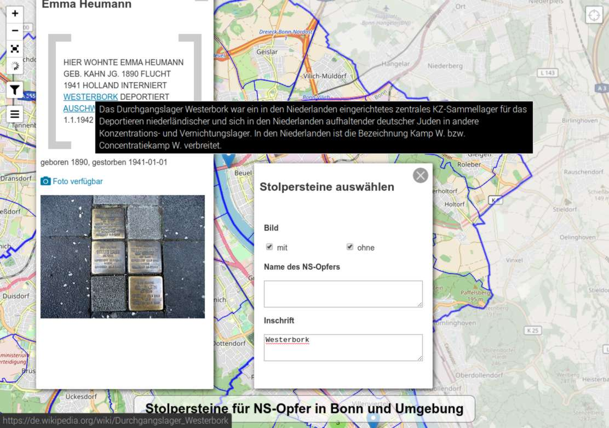

# stolperstein-bonn

In Bonn sind bislang (Stand 10/2020) 325 Stolpersteine verlegt worden (Quelle:
[Gedenkstätte und NS-Dokumentationszentrum Bonne.V.](http://www.ns-gedenkstaetten.de/nrw/bonn/forschung-und-projekte/bonner-stolpersteine.html)),
die an Opfer der NS-Gräuel erinnern sollen. Die Absicht dieses Projekts besteht darin, die Bonner Stolpersteine in
einem möglichst offenen Format digital aufzubereiten. Auf diese Weise sollen die Schicksale, für die diese
Stolpersteine stehen, auch in der der virtuellen Datenwelt präsent werden.

Die Darstellung hat zwei Arten von Markern, graue und blaue. Die blauen markieren Stolpersteine, deren Fotos online
sind, die grauen solche, bei denen nur Textinformationen zur Verfügung stehen.

Es gibt mittlerweile auch eine
[Seite der Stadt Bonn](https://www.bonn.de/themen-entdecken/bildung-lernen/stolpersteine.php) zu den Stolpersteinen,
die jedoch lieblos gemacht ist, die verfügbaren Fotos der Stolpersteine nicht zugänglich macht, keine Filterfunktion
hat, ...

Wie zu erkennen, werden bestimmte Begriffe in den Texten der Stolpersteine automatisch erkannt, mit
Zusatzinformationen versehen und mit Wikipedia-Artikeln verknüpft. Dass es sich dabei um einen Personennamen handelt
ist eine Ausnahme, Felix Hausdorff ist ein weltberühmter Mathematiker, der als einer der Begründer eines ganzen
Gebiets der Mathematik gilt (der Toplogie). Hier ein typischeres Beispiel:

## Website

Die Karte befindet sich unter https://stolpersteine-in-bonn.de/ - anders als die bisherige Version funktioniert sie auch mobil problemlos.

## Datenquellen

### Stolpersteine

Die Informationen zu den Stolpersteinen werden regelmäßig aus der OpenStreetMap-Datenbank extrahiert.

### Grenzen der Stadt, Stadtbezirke und Ortsteile

Die verwendeten Informationen sind von der Stadt Bonn als OpenData der Allgemeinheit zur Verfügung gestellt worden.

* Lizenz: https://creativecommons.org/publicdomain/zero/1.0/

* Ortsteile: http://opendata.bonn.de/dataset/flächen-der-ortsteile

* Stadtbezirke: http://opendata.bonn.de/dataset/flächen-der-stadtbezirke

* Stadt: http://opendata.bonn.de/dataset/fläche-des-stadtgebiets

## Probleme

Der Datensatz *Flächen der Ortsteile* ist zur Zeit fehlerhaft; die Namen der Ortsteile sind in Latin-1 kodiert,
obwohl die JSON-Spezifikation UTF-8 vorschreibt. Ich habe diesen Kodierungsfehler (leider keine Seltenheit) bereits
gemeldet. Behebung des Problems mittels iconv:

    mv ortsteile.js ortsteile.bak.js
    iconv -f ISO8859-1 -t UTF8 ortsteile.bak.js > ortsteile.js
