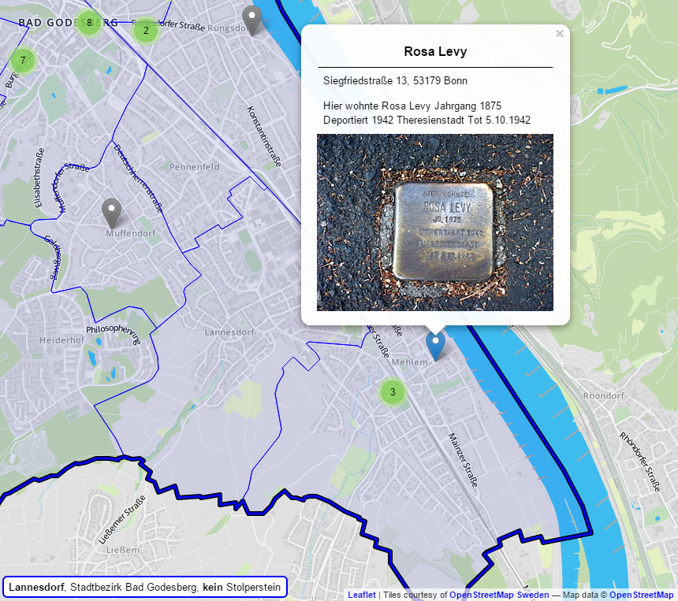

# stolperstein-bonn

In Bonn sind bislang (Stand 12/2014) 275 Stolpersteine verlegt worden, die an
Opfer der NS-Gräuel erinnern sollen. Die Absicht dieses Projekts besteht darin,
die Bonner Stolpersteine in einem möglichst offenen Format digital
aufzubereiten. Auf diese Weise sollen die Schicksale, für die diese
Stolpersteine stehen, auch in der der virtuellen Datenwelt präsent werden.

Ausgangspunkt sind SQL-Skripte, die eine SQLite3-Datenbank befüllen. Ein
Ruby-Skript führt die einzelnen SQL-Skripte in der richtigen Reihenfolge
zusammen. Die Reihenfolge ist wichtig, da die SQL-Skripte zum Verhindern von
Fehlern und Inkonsistenzen die Abhängigkeiten der Daten erzwingen.

Aus der Datenbank wird dann mit Hilfe eines weiteren Ruby-Skripts eine
GeoJSON-Datei erzeugt, die anschließend von einer Internetseite mit Hilfe von
Leaflet durch Marker auf einer Karte Bonns angezeigt wird. Beim Anklicken des
Markers erscheinen die zugehörigen Informationen in einem Popup-Fenster.

Das Repository enthält zudem eine fertige SQLite3-Datenbank mit den bislang
erfassten Stolperstein-Daten.

## Demo

Eine Demo findet sich unter [[http://penpendede.github.io/stolperstein-bonn/][http://penpendede.github.io/stolperstein-bonn/]]
